# AIOS Web System Design & Architecture

This document provides a comprehensive technical overview of the `aios-web` system architecture. It outlines every major architectural decision, how data flows through the application, and precisely how `aios-web` interfaces with the broader local Obsidian AIOS Vault.

---

## 1. High-Level Architecture Overview

`aios-web` is a multi-tenant SaaS layer built on top of a local markdown vault. It provides relational data querying, an interactive web UI, and background autonomous AI processing, while continuously syncing back to plain text files.

### 1.1 Architecture Diagram

```mermaid
graph TD
    %% Frontend Layer
    subgraph Client [Frontend / UI Layer]
        React[React 18 + Vite SPA]
        Zustand[Zustand - Global State]
        RQ[React Query - Server State]
        UI[@ledgr/ui Design System]
        
        React --> Zustand
        React --> RQ
        React --> UI
    end

    %% Network
    Client -- "REST API (JWT Auth)" --> API
    Client -- "WebSockets (Sync/Chat)" --> API

    %% Backend Layer
    subgraph Backend [Backend / API Layer - FastAPI]
        API[FastAPI Routers]
        Auth[JWT Auth Middleware]
        Services[Service Logic]
        SQLModel[SQLModel ORM]
        Agents[Background Agents/APScheduler]
        Chat[Multi-LLM Engine]
        
        API --> Auth
        Auth --> Services
        Services --> SQLModel
        Services --> Chat
        Agents --> SQLModel
        Agents --> Chat
    end

    %% Persistence Layer
    subgraph Storage [Data Persistence]
        DB[(PostgreSQL 15 + pgvector)]
    end

    %% External Systems
    subgraph External [AI Providers & External APIs]
        OpenAI[OpenAI API]
        Anthropic[Anthropic API]
        Stripe[Stripe Billing]
    end

    %% Sync Layer
    subgraph Sync [Vault Sync Engine]
        Watcher[watcher.py]
        Parser[parser.py]
        Writer[writer.py]
        Guard[VaultWriteGuard]
    end

    %% Local Vault
    subgraph Obsidian [Local Obsidian Vault - AIOS]
        MD[Markdown Files]
        Frontmatter[YAML Frontmatter]
    end

    SQLModel <--> DB
    Chat <--> OpenAI
    Chat <--> Anthropic
    Services <--> Stripe
    
    %% Sync Connections
    Services --> Writer
    Writer --> Guard
    Guard --> MD
    
    MD --> Watcher
    Watcher --> Parser
    Parser --> Services
```

---

## 2. Core Architectural Decisions

### 2.1 Multi-Tenant Database Isolation
- **Decision:** Shift from a single-user local tool to a multi-tenant SaaS application.
- **Implementation:** PostgreSQL is the core database, managed via SQLModel (SQLAlchemy). Every single user-data table contains a strict `user_id` foreign key.
- **Security:** The backend enforces data isolation at the route/service level. The `current_user` is extracted from the HttpOnly Strict JWT cookie, and all queries append `.where(Model.user_id == current_user.id)`.

### 2.2 Design System & Theming
- **Decision:** Fully remove Tailwind in favor of a strict token-based custom component library.
- **Implementation:** `@ledgr/ui` is used alongside `styled-components`. A global `ThemeProvider` injects the "Premium Black + Gold" theme.
- **Why:** Ensures absolute design consistency, prevents utility-class clutter in React components, and enforces strict brand guidelines (e.g., specific HEX values instead of generic HSL variables).

### 2.3 State Management Split
- **Decision:** Separate server state from client/UI state.
- **Implementation:** 
  - **Zustand** is used for ephemeral UI state (e.g., active tabs, dark mode, modal visibility).
  - **React Query (TanStack)** is used for all server data. This eliminates `useEffect` fetching boilerplate, handles caching, and provides loading/error states out of the box.

---

## 3. Vault Synchronization Flow

The most unique architectural aspect of `aios-web` is its two-way synchronization with a local Obsidian markdown vault. The Postgres database acts as a fast, relational cache and UI backend, while the Vault acts as the durable, user-owned source of truth.

### 3.1 Two-Way Sync Data Flow

```mermaid
sequenceDiagram
    participant User as User / Browser
    participant API as FastAPI Backend
    participant DB as PostgreSQL
    participant Sync as Vault Sync Engine
    participant Vault as Obsidian (.md)

    %% Web to Vault Flow
    rect rgb(20, 30, 40)
    Note over User, Vault: Flow 1: Web Interface -> Obsidian Vault
    User->>API: POST /api/finance/transaction (JWT)
    API->>DB: Validate & Insert (user_id)
    API->>Sync: Trigger writer.py
    Sync->>Sync: VaultWriteGuard (Concurrency Lock)
    Sync->>Vault: Write/Update Markdown file
    end

    %% Vault to Web Flow
    rect rgb(30, 20, 20)
    Note over User, Vault: Flow 2: Obsidian Vault -> Web Interface
    Vault-->>Sync: watcher.py detects file save event
    Sync->>Sync: parser.py extracts YAML Frontmatter
    Sync->>API: Internal API call to update record
    API->>DB: Update corresponding row
    API-->>User: WebSocket broadcast (UI auto-refreshes)
    end
```



### 3.2 Vault Write Tools & Safety
The background AI agents and the Chat Assistant are equipped with "Active Write Tools" (e.g., `create_action`, `log_transaction`). 
- When an AI triggers a write, it goes through the `VaultWriteGuard`.
- This guard implements SQLite/Postgres concurrency locks and checks for path traversals to ensure the AI doesn't corrupt the vault or overwrite files simultaneously.

---

## 4. Background Agents & Multi-LLM Engine

`aios-web` employs a swarm of background autonomous agents that execute tasks via APScheduler.

### 4.1 Agent Execution Flow

```mermaid
graph LR
    subgraph Scheduler
        Cron[APScheduler (Cron Jobs)]
    end
    
    subgraph Agent Runner
        Context[Context Builder]
        LLM[OpenAI / Claude API]
        Tools[Write Tools Execution]
    end
    
    subgraph Outputs
        DB[(PostgreSQL)]
        Sync[Vault Sync]
        UI[Live Terminal UI]
    end

    Cron -- "Triggers at scheduled time" --> Context
    Context -- "Fetches domain-scoped facts" --> LLM
    LLM -- "Decides on Action" --> Tools
    Tools -- "Writes Data" --> DB
    Tools -- "Syncs Data" --> Sync
    LLM -- "Streams logs via WS" --> UI
```

### 4.2 Agent Architectural Principles
- **Domain-Scoped Isolation:** An agent designed for the "Finance" domain (e.g., `aios-monthly-finance`) is strictly sandboxed. Its context window is only populated with financial facts, and it cannot access health or career data.
- **Graceful Fallbacks:** If an LLM API fails (e.g., quota exceeded), the agent catches the exception and falls back to a deterministic, rule-based execution, prefixing logs with a standard warning so the user knows it ran in fallback mode.
- **Stream Options & Token Accounting:** Deeply integrated logic tracks token usage precisely across streaming API responses to monitor costs and prevent overflow errors.

---

## 5. Deployment & Infrastructure

- **Containerization:** The entire stack is containerized via `docker-compose.yml`.
  - Service 1: `frontend` (Vite dev server or Nginx production build)
  - Service 2: `backend` (Uvicorn + FastAPI)
  - Service 3: `postgres` (with `pgvector` extensions for RAG/Embeddings)
- **Hot Reloading Context:** Backend hot-reloading is disabled in Docker to prevent Vault Watcher memory leaks and race conditions. Any Python edit requires an explicit `docker compose restart backend`.
- **Migrations:** Handled strictly by Alembic (`alembic upgrade head`).

---
*Generated by Antigravity AI — AIOS Architecture Documentation*
